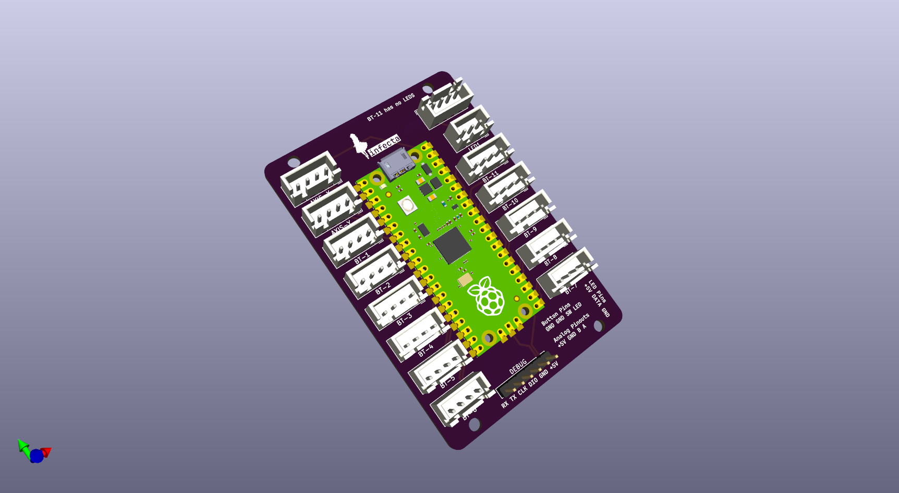

## pi-pico-shield

A shield for the Raspberry Pi Pico for use as a game controller with SpeedyPotato's Pico-Game-Controller firmwarehttps://github.com/speedypotato/Pico-Game-Controller

# Disclaimer

- I am by no means someone who is knowledgeable when it comes to PCB design. This is my first ever design that has actually been produced.
- This board was meant as a drop-in replacement for the Yuancon/[Roxy](https://github.com/veroxzik/roxy-board) but due to [oversights](./repo_images/board_issue.png) the board did was not long enough to align to the screw standoffs. (EDIT: [Upon further inspection my measurements weren't off. I'm guessing the roxy was meant for the OLDER Yuan boards](./repo_images/comparison.png))

# Production

Gerbers are stored in the `_prod` folder of the repo as `gerbers.zip`

In JLCPCB you can pretty much get away with the default options offered by the site. Im not sure about other PCB manufacturing services so do your research.

# CREDITS

~~(I don't have proper time for crediting people in this README at the moment *im sorry*)~~ I have time now~

[SpeedyPotato](https://github.com/speedypotato/RP_Silicon_KiCad) | For his Pi-Pico Footprint that makes the USB test pads exposed for easy soldering

[veroxzik](https://github.com/veroxzik/roxy-board) | For their initial screwhole measurements from the roxy board

(There might be more people I forgot to credit and in that case I apologize)